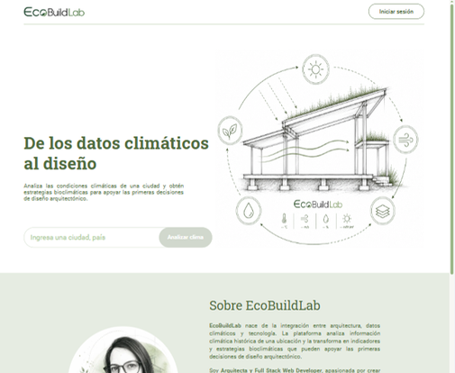
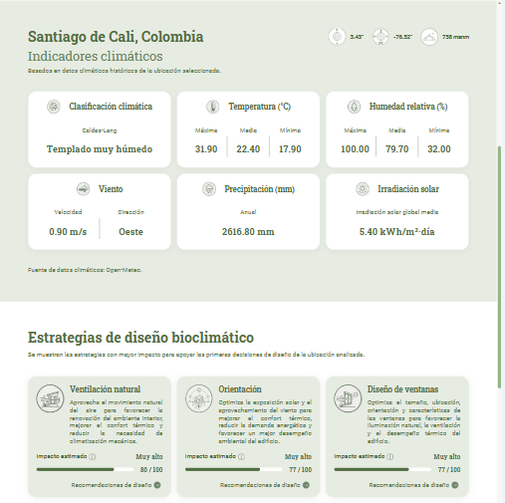
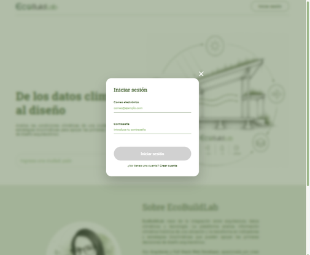
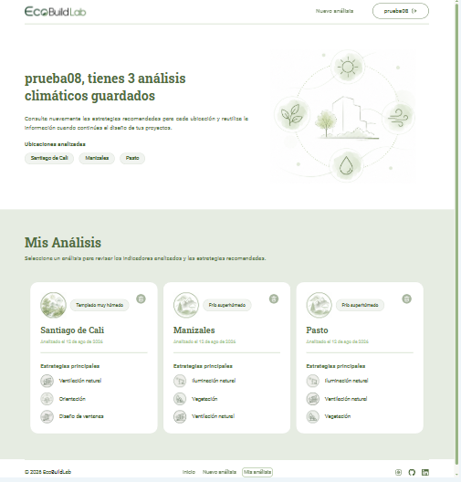
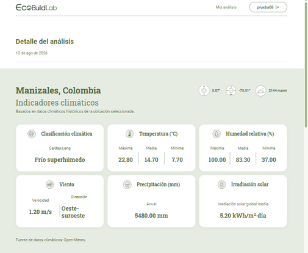

# EcoBuildLab

EcoBuildLab es una aplicación web para realizar análisis bioclimáticos de una ubicación y generar recomendaciones de estrategias de diseño pasivo adaptadas a sus condiciones climáticas.

La aplicación integra datos climáticos históricos de **Open-Meteo**, clasificación climática **Caldas-Lang** y criterios de diseño bioclimático para facilitar una primera aproximación al análisis ambiental de un sitio y apoyar la toma de decisiones en las primeras etapas del diseño arquitectónico sostenible.

El proyecto fue desarrollado como proyecto final del programa de Desarrollo Web de **TripleTen**.

---

## Demo

La aplicación se encuentra desplegada y disponible en:

**https://ecobuildlab.duckdns.org**

---

## Objetivo

EcoBuildLab busca facilitar una primera aproximación al análisis bioclimático de un sitio mediante la integración de:

- Datos climáticos históricos.
- Indicadores ambientales.
- Clasificación climática.
- Estrategias de diseño pasivo.
- Visualización de resultados.
- Almacenamiento de análisis para usuarios registrados.

La aplicación está orientada principalmente a estudiantes, arquitectos y profesionales interesados en arquitectura bioclimática, sostenibilidad y diseño adaptado a las condiciones climáticas del sitio.

---

## Funcionalidades

### Análisis climático

- Consulta climática para ubicaciones de todo el mundo.
- Búsqueda de ubicaciones mediante geocodificación.
- Obtención de datos climáticos históricos.
- Procesamiento de variables ambientales.
- Clasificación climática mediante Caldas-Lang.
- Generación de estrategias bioclimáticas pasivas.

### Indicadores climáticos

La aplicación presenta información relacionada con:

- Temperatura media, máxima y mínima.
- Humedad relativa.
- Velocidad y dirección predominante del viento.
- Radiación solar.
- Precipitación.
- Clasificación climática.
- Ubicación geográfica.
- Elevación.

### Autenticación

- Registro de usuarios.
- Inicio de sesión.
- Validación de formularios en tiempo real.
- Autenticación mediante JWT.
- Persistencia del token mediante `localStorage`.
- Consulta del usuario autenticado.
- Cierre de sesión.
- Manejo de estados autenticado y no autenticado.

### Análisis guardados

Los usuarios autenticados pueden:

- Guardar análisis bioclimáticos.
- Consultar sus análisis guardados.
- Abrir el detalle de un análisis.
- Eliminar análisis guardados.
- Acceder únicamente a sus propios análisis.

Las operaciones de análisis guardados se realizan mediante la API REST del backend.

---

## Tecnologías utilizadas

### Frontend

- React
- JavaScript (ES6+)
- React Router
- HTML5
- CSS3
- Vite

### Autenticación y comunicación con el backend

- JWT
- `localStorage`
- API REST
- Fetch API

### APIs externas

- Open-Meteo Geocoding API
- Open-Meteo Historical Weather API

### Backend

- Node.js
- Express
- MongoDB
- Mongoose

---

## Arquitectura del proyecto

```text
                        EcoBuildLab
                             │
                             ▼
                         React App
                             │
              ┌──────────────┴──────────────┐
              │                             │
              ▼                             ▼
       Open-Meteo API                 Backend REST API
              │                             │
              │                             │
              ▼                             ▼
      Datos climáticos                 Autenticación
      Geocodificación                  JWT
                                       Análisis guardados
                                             │
                                             ▼
                                          MongoDB
```

El frontend consume directamente las APIs de Open-Meteo para obtener información climática y se comunica con el backend de EcoBuildLab para autenticación y gestión de análisis guardados.

---

## Flujo de la aplicación

```text
Usuario
   │
   ▼
Busca una ubicación
   │
   ▼
Geocodificación
   │
   ▼
Open-Meteo
   │
   ▼
Datos climáticos históricos
   │
   ▼
Procesamiento de indicadores
   │
   ▼
Clasificación Caldas-Lang
   │
   ▼
Estrategias bioclimáticas
   │
   ▼
Resultados del análisis
```

Si el usuario está autenticado:

```text
Resultado del análisis
        │
        ▼
Guardar análisis
        │
        ▼
Backend REST API
        │
        ▼
MongoDB
        │
        ▼
Análisis asociado al usuario
```

---

## Autenticación

El frontend implementa autenticación mediante JWT.

El flujo de autenticación es:

```text
Usuario
   │
   ▼
Formulario de registro
   │
   ▼
POST /api/signup
   │
   ▼
Usuario registrado
```

Para iniciar sesión:

```text
Usuario
   │
   ▼
Formulario de inicio de sesión
   │
   ▼
POST /api/signin
   │
   ▼
JWT
   │
   ▼
localStorage
   │
   ▼
CurrentUserContext
   │
   ▼
Aplicación autenticada
```

El token JWT se utiliza posteriormente para realizar solicitudes protegidas al backend mediante:

```http
Authorization: Bearer <token>
```

---

## Rutas principales del frontend

### Página principal

```text
/
```

Permite realizar búsquedas y generar nuevos análisis climáticos.

### Página de análisis guardados

```text
/saved-analysis
```

Ruta protegida disponible únicamente para usuarios autenticados.

Permite consultar los análisis guardados asociados a la cuenta.

### Página de detalle

```text
/analysis/:id
```

Ruta protegida que permite consultar el detalle de un análisis guardado.

---

## Protección de rutas

Las rutas que contienen información privada están protegidas mediante el componente `ProtectedRoute`.

Si un usuario no autenticado intenta acceder directamente a una ruta protegida, la aplicación verifica su estado de autenticación y evita el acceso al contenido privado.

Las principales rutas protegidas son:

```text
/saved-analysis
/analysis/:id
```

---

## Estado global del usuario

La aplicación utiliza `CurrentUserContext` mediante React Context API para mantener disponible la información del usuario autenticado.

El contexto permite:

- Conocer el estado de autenticación.
- Mantener la información del usuario actual.
- Actualizar el estado después del inicio de sesión.
- Restaurar la sesión utilizando el JWT almacenado.
- Cerrar la sesión y limpiar el estado correspondiente.

---

## Validación de formularios

Los formularios de registro e inicio de sesión implementan validación en el frontend.

Se validan:

- Campos obligatorios.
- Formato válido del correo electrónico.
- Contraseña.
- Estado de validez del formulario.

La validación se realiza de manera inmediata mientras el usuario introduce información.

Los mensajes de error se muestran directamente en la interfaz.

Los botones de envío permanecen deshabilitados mientras el formulario no cumple las condiciones requeridas.

---

## Componentes principales

La aplicación está organizada mediante componentes reutilizables.

Entre los principales componentes se encuentran:

```text
App
│
├── Header
├── Navigation
├── Hero
├── SearchForm
├── Results
├── ClimateSummary
├── IndicatorCardList
├── StrategySection
├── StrategyCard
├── StrategyModal
├── SavedAnalysisHeader
├── AnalysisCardList
├── AnalysisCard
├── AnalysisPage
├── Login
├── Register
├── ProtectedRoute
├── Preloader
├── Notification
└── Footer
```

La estructura permite separar responsabilidades y facilitar el mantenimiento de la aplicación.

---

## Estructura del proyecto

```text
src
│
├── components
│   ├── About
│   ├── AnalysisCard
│   ├── AnalysisCardList
│   ├── AnalysisPage
│   ├── ClimateSummary
│   ├── Footer
│   ├── Header
│   ├── Hero
│   ├── Login
│   ├── Navigation
│   ├── Preloader
│   ├── ProtectedRoute
│   ├── Register
│   ├── Results
│   ├── SaveAnalysisSection
│   ├── SavedAnalysisHeader
│   ├── SearchForm
│   ├── StrategyCard
│   ├── StrategyModal
│   └── StrategySection
│
├── context
│
├── images
│
├── services
│
├── utils
│
├── styles
│
├── App.jsx
└── main.jsx
```

---

## Servicios

La comunicación con las APIs se organiza mediante servicios independientes.

El frontend utiliza servicios para:

- Autenticación.
- Registro.
- Inicio de sesión.
- Consulta del usuario actual.
- Generación de análisis.
- Guardado de análisis.
- Consulta de análisis guardados.
- Consulta de un análisis específico.
- Eliminación de análisis.

---

## API de producción

El frontend se comunica con el backend mediante HTTPS.

### Backend

https://ecobuildlab.duckdns.org

### API

https://ecobuildlab.duckdns.org/api

---

## APIs externas

### Open-Meteo

EcoBuildLab utiliza Open-Meteo para obtener información climática y geográfica.

Los servicios utilizados permiten obtener:

- Coordenadas de ubicaciones.
- Datos históricos de temperatura.
- Humedad.
- Viento.
- Radiación.
- Precipitación.
- Otras variables climáticas utilizadas en el análisis.

Los datos son posteriormente procesados por EcoBuildLab para generar indicadores y recomendaciones.

---

## Clasificación climática

EcoBuildLab utiliza el sistema de clasificación climática **Caldas-Lang**.

La clasificación se obtiene a partir de los datos climáticos procesados y permite identificar el tipo de clima predominante de la ubicación analizada.

A partir de esta clasificación se seleccionan estrategias bioclimáticas pasivas relacionadas con las condiciones ambientales del sitio.

---

## Estrategias bioclimáticas

La aplicación genera recomendaciones relacionadas con estrategias pasivas como:

- Orientación.
- Protección solar.
- Diseño de ventanas.
- Aislamiento.
- Materiales.
- Ventilación natural.
- Iluminación natural.
- Vegetación.

Estas estrategias se presentan de acuerdo con las condiciones climáticas identificadas.

---

## Diseño responsive

La interfaz está diseñada para adaptarse a diferentes tamaños de pantalla:

- Escritorio.
- Tablet.
- Dispositivos móviles.

La aplicación utiliza CSS responsive para adaptar la distribución de los componentes y facilitar la navegación desde diferentes dispositivos.

---

## Manejo de estados de carga

La aplicación utiliza componentes de carga para proporcionar retroalimentación visual durante operaciones que requieren procesamiento.

El componente `Preloader` se utiliza principalmente para:

- Generación de nuevos análisis.
- Recuperación de análisis guardados.
- Procesamiento de solicitudes.

Los mensajes de carga se adaptan según el tipo de operación.

---

## Manejo de errores

La aplicación proporciona retroalimentación visual cuando ocurre un error durante:

- Inicio de sesión.
- Registro.
- Consulta de datos climáticos.
- Generación de análisis.
- Guardado de análisis.
- Consulta de análisis guardados.
- Eliminación de análisis.

Los mensajes se muestran mediante componentes de notificación y estados de error.

---

## Optimización de recursos

Las imágenes utilizadas por la aplicación han sido optimizadas para mejorar el rendimiento de carga.

Se utilizan formatos WebP para recursos gráficos que no requieren conservar el formato PNG original, reduciendo significativamente el tamaño de los archivos.

Por ejemplo, algunos recursos pasaron de tamaños superiores a 1 MB a archivos WebP de pocos KB.

Esto permite reducir el peso inicial de la aplicación y mejorar los tiempos de carga.

---

## Instalación

### Clonar el repositorio

```bash
git clone https://github.com/Ximerm/ecobuildlab-frontend.git
```

### Entrar al proyecto

```bash
cd ecobuildlab-frontend
```

### Instalar dependencias

```bash
npm install
```

---

---

## Variables de entorno

Para ejecutar el proyecto localmente, configurar las variables de entorno necesarias según el entorno de ejecución.

### Desarrollo

```env
VITE_API_URL=http://localhost:3000/api
```

### Producción

```env
VITE_API_URL=https://ecobuildlab.duckdns.org/api
```

Las variables de entorno permiten configurar la URL del backend según el entorno de ejecución.

Las variables sensibles no deben almacenarse directamente en el repositorio.

---

## Scripts

### Desarrollo

```bash
npm run dev
```

Inicia el servidor de desarrollo de Vite.

### Lint

```bash
npm run lint
```

Ejecuta ESLint para comprobar la calidad y consistencia del código.

### Build

```bash
npm run build
```

Genera la versión optimizada de producción.

---

## Construcción para producción

Para generar la versión de producción:

```bash
npm run build
```

Los archivos generados se encuentran en:

```text
dist/
```

El contenido de `dist` se utiliza para desplegar la aplicación frontend.

---

## Despliegue

El frontend se encuentra desplegado junto con el backend en Google Cloud Platform.

La infraestructura utiliza:

- Ubuntu
- Nginx
- Node.js / backend Express
- Google Cloud Compute Engine
- HTTPS
- Let's Encrypt
- DuckDNS

La aplicación web es accesible mediante:

https://ecobuildlab.duckdns.org

---

## Capturas de pantalla

### Página principal

<p align="center">
  
</p>

### Resultados del análisis

<p align="center">
  
</p>

### Inicio de sesión

<p align="center">
  
</p>

### Análisis guardados

<p align="center">
  
</p>

### Detalle de análisis

<p align="center">
  
</p>

---

## Repositorio

GitHub:

https://github.com/Ximerm/ecobuildlab-frontend

---

## Proyecto académico

EcoBuildLab fue desarrollado como proyecto final del programa de Desarrollo Web de **TripleTen**.

El proyecto integra desarrollo frontend, consumo de APIs externas, autenticación, comunicación con un backend REST, persistencia de datos y despliegue de una aplicación full stack.

---

## Licencia

Este proyecto se distribuye bajo la licencia MIT.

---

## Autora

**Ximena Rodríguez**

GitHub:

https://github.com/Ximerm
