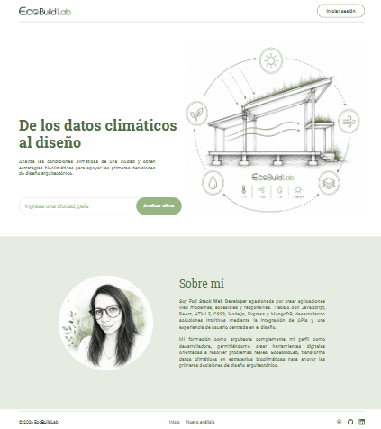
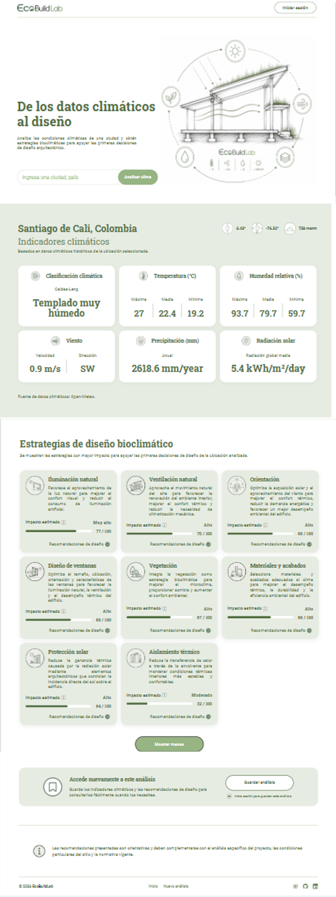
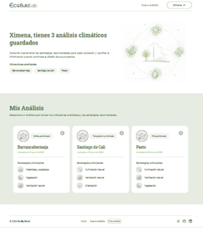
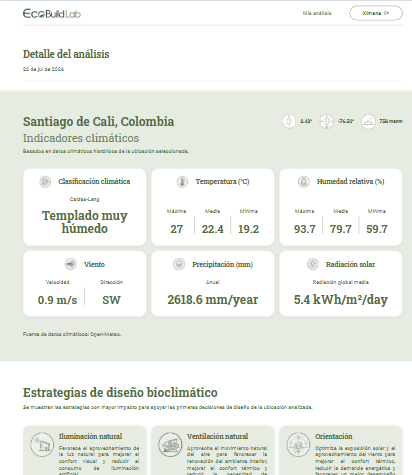

# EcoBuildLab

EcoBuildLab es una aplicación web que analiza las condiciones climáticas de una ubicación y genera recomendaciones de estrategias bioclimáticas pasivas para el diseño arquitectónico.

El proyecto integra datos climáticos históricos obtenidos mediante la API de Open-Meteo y utiliza la clasificación climática Caldas-Lang para identificar el clima predominante y proponer estrategias de diseño adaptadas a las condiciones ambientales del lugar.

Este proyecto fue desarrollado como proyecto final del programa de Desarrollo de Software de TripleTen.

## Objetivo

Facilitar una primera aproximación al análisis bioclimático de un sitio mediante la integración de datos climáticos, indicadores ambientales y recomendaciones de diseño pasivo en una interfaz web sencilla e intuitiva.

La aplicación busca servir como una herramienta de apoyo para estudiantes, arquitectos y profesionales interesados en el diseño bioclimático.

## Funcionalidades

- Consulta climática para ciudades de todo el mundo.
- Obtención de datos históricos mediante la API de Open-Meteo.
- Clasificación climática utilizando el sistema Caldas-Lang.
- Visualización de indicadores climáticos:
  - Temperatura media, máxima y mínima.
  - Humedad relativa.
  - Velocidad y dirección predominante del viento.
  - Radiación solar.
  - Precipitación media anual.
- Generación de estrategias bioclimáticas pasivas según el clima identificado.
- Guardado y consulta de análisis realizados.
- Diseño responsive para dispositivos móviles, tabletas y escritorio.

## Tecnologías utilizadas

### Frontend

- React
- React Router
- JavaScript (ES6+)
- HTML5
- CSS3
- Vite

### APIs

- Open-Meteo Historical Weather API
- Open-Meteo Geocoding API

### Almacenamiento

- Local Storage

## Metodología

El análisis climático se realiza a partir de datos históricos obtenidos mediante Open-Meteo. A partir de estos datos se calculan indicadores climáticos representativos como temperatura, humedad, precipitación, radiación y viento.

Posteriormente, la aplicación determina el clima predominante utilizando la clasificación climática Caldas-Lang y genera automáticamente estrategias bioclimáticas pasivas acordes con las características del clima identificado.

## Demo

🔗 Próximamente

## Capturas de pantalla

### Página principal

### Resultados del análisis

### Análisis guardados

### Detalle del análisis

## Flujo de trabajo

1. El usuario busca una ciudad.
2. La aplicación obtiene las coordenadas mediante la API de Geocoding.
3. Se consultan los datos climáticos históricos en Open-Meteo.
4. Se procesan los indicadores climáticos.
5. Se clasifica el clima utilizando el sistema Caldas-Lang.
6. Se generan estrategias bioclimáticas pasivas.
7. El usuario puede guardar el análisis para futuras consultas.

## Características técnicas

- React Router para navegación.
- Componentes reutilizables.
- Responsive Design.
- Manejo de estados mediante Hooks.
- Consumo de APIs REST.
- Procesamiento de datos climáticos.
- Persistencia mediante Local Storage.

## Acerca del proyecto

EcoBuildLab nace con el propósito de acercar el análisis bioclimático a estudiantes y profesionales mediante una herramienta sencilla, accesible y basada en datos climáticos históricos.

El proyecto busca demostrar cómo el desarrollo de software puede integrarse con la arquitectura sostenible para apoyar la toma de decisiones durante las primeras etapas del diseño.
